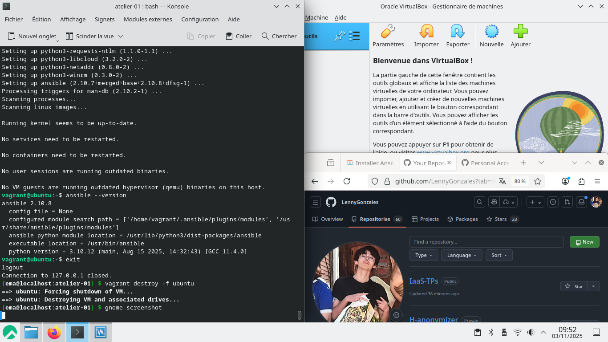
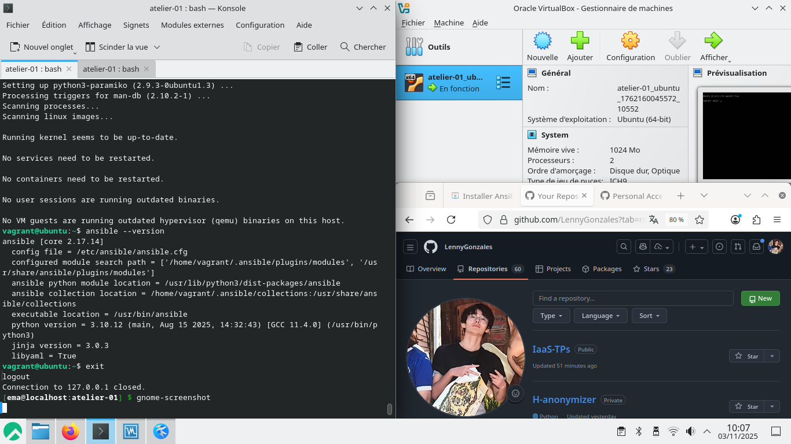
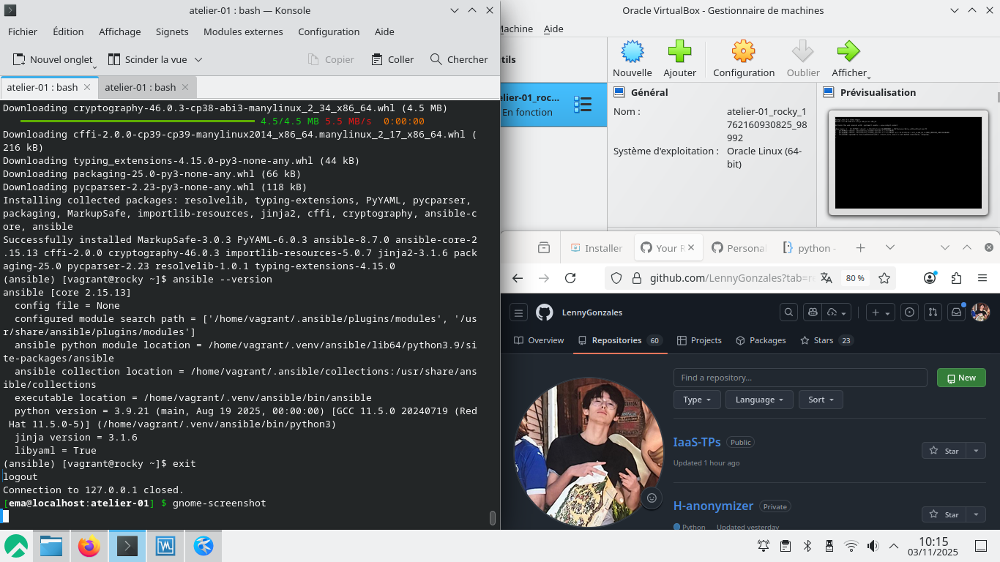

# Atelier 01

## Challenge 01

Démarrage de la VM Ubuntu :
```bash
vagrant up ubuntu
```

Connexion à la VM Ubuntu :
```bash
vagrant ssh ubuntu
```

Mise à jour des informations sur les paquets :
```bash
sudo apt update
```

Recherche du paquet Ansible :
```bash
apt-cache search --names-only ansible
```

Installation d'Ansible :
```bash
sudo apt install -y ansible
```

Vérification de l'installation d'Ansible :
```bash
ansible --version
```

On quitte la VM :
```bash
exit
```

Suppression de la VM :
```bash
vagrant destroy -f ubuntu
```

Résultat :
Version d'Ansible installée :
```bash
vagrant@ubuntu:~$ ansible --version
ansible 2.10.8
  config file = None
  configured module search path = ['/home/vagrant/.ansible/plugins/modules', '/usr/share/ansible/plugins/modules']
  ansible python module location = /usr/lib/python3/dist-packages/ansible
  executable location = /usr/bin/ansible
  python version = 3.10.12 (main, Aug 15 2025, 14:32:43) [GCC 11.4.0]
```


## Challenge 02

Démarrage de la VM Ubuntu :
```bash
vagrant up ubuntu
```

Connexion à la VM Ubuntu :
```bash
vagrant ssh ubuntu
```

Mise à jour des informations sur les paquets :
```bash
sudo apt update
```

Ajout du dépôt PPA pour Ansible :
```bash
sudo apt-add-repository ppa:ansible/ansible
```

Recherche du paquet Ansible :
```bash
apt-cache search --names-only ansible
```

Installation d'Ansible :
```bash
sudo apt install -y ansible
```

Vérification de l'installation d'Ansible :
```bash
ansible --version
```

On quitte la VM :
```bash
exit
```

Suppression de la VM :
```bash
vagrant destroy -f ubuntu
```

Résultat :
Version d'Ansible installée :
```bash
vagrant@ubuntu:~$ ansible --version
ansible [core 2.17.14]
  config file = /etc/ansible/ansible.cfg
  configured module search path = ['/home/vagrant/.ansible/plugins/modules', '/usr/share/ansible/plugins/modules']
  ansible python module location = /usr/lib/python3/dist-packages/ansible
  ansible collection location = /home/vagrant/.ansible/collections:/usr/share/ansible/collections
  executable location = /usr/bin/ansible
  python version = 3.10.12 (main, Aug 15 2025, 14:32:43) [GCC 11.4.0] (/usr/bin/python3)
  jinja version = 3.0.3
  libyaml = True
```


## Challenge 03

Démarrage de la VM Ubuntu :
```bash
vagrant up rocky
```

Connexion à la VM Ubuntu :
```bash
vagrant ssh rocky
```

Installation du paquet 'python3-pip' :
```bash
sudo dnf install python3-pip
```

Initialisez l'environnement Virtualenv :
```bash
python3 -m venv ~/.venv/ansible
```

Lancez Virtualenv :
```bash
source ~/.venv/ansible/bin/activate
```

Mettez à jour PIP pour cette première utilisation :
```bash
pip install --upgrade pip
```

Installez Ansible :
```bash
pip install ansible
```

Vérification de l'installation d'Ansible :
```bash
ansible --version
```

On quitte la VM :
```bash
exit
```

Suppression de la VM :
```bash
vagrant destroy -f ubuntu
```

Résultat :
Version d'Ansible installée :
```bash
(ansible) [vagrant@rocky ~]$ ansible --version
ansible [core 2.15.13]
  config file = None
  configured module search path = ['/home/vagrant/.ansible/plugins/modules', '/usr/share/ansible/plugins/modules']
  ansible python module location = /home/vagrant/.venv/ansible/lib64/python3.9/site-packages/ansible
  ansible collection location = /home/vagrant/.ansible/collections:/usr/share/ansible/collections
  executable location = /home/vagrant/.venv/ansible/bin/ansible
  python version = 3.9.21 (main, Aug 19 2025, 00:00:00) [GCC 11.5.0 20240719 (Red Hat 11.5.0-5)] (/home/vagrant/.venv/ansible/bin/python3)
  jinja version = 3.1.6
  libyaml = True
```

