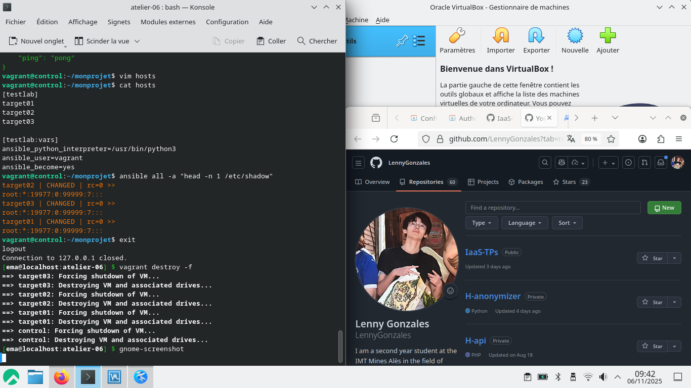

# Atelier 06

## À vous de jouer

- Démarrez les VM :

```bash
$ vagrant up
```

- Connectez-vous au Control Host :
```bash
$ vagrant ssh control
```

- Éditez /etc/hosts de manière à ce que les Target Hosts soient joignables par leur nom d'hôte simple.
```bash
192.168.56.10  control.sandbox.lan    control
192.168.56.20  target01.sandbox.lan   target01
192.168.56.30  target02.sandbox.lan   target02
192.168.56.40  target03.sandbox.lan   target03
```

- Configurez l'authentification par clé SSH avec les trois Target Hosts.
```bash
ssh-keyscan -t rsa target01 target02 target03 >> .ssh/known_hosts

ssh-keygen
ssh-copy-id vagrant@target01
ssh-copy-id vagrant@target02
ssh-copy-id vagrant@target03
```

```bash
vagrant@control:~$ ssh target01
Welcome to Ubuntu 22.04.5 LTS (GNU/Linux 5.15.0-160-generic x86_64)

vagrant@control:~$ ssh target02
Welcome to Ubuntu 22.04.5 LTS (GNU/Linux 5.15.0-160-generic x86_64)

vagrant@control:~$ ssh target03
Welcome to Ubuntu 22.04.5 LTS (GNU/Linux 5.15.0-160-generic x86_64)

```

- Installez Ansible.
```bash
sudo apt update
sudo apt install -y ansible
```

```bash
vagrant@control:~$ ansible --version
ansible 2.10.8
  config file = None
  configured module search path = ['/home/vagrant/.ansible/plugins/modules', '/usr/share/ansible/plugins/modules']
  ansible python module location = /usr/lib/python3/dist-packages/ansible
  executable location = /usr/bin/ansible
  python version = 3.10.12 (main, Aug 15 2025, 14:32:43) [GCC 11.4.0]
```

- Envoyez un premier ping Ansible sans configuration.
```bash
vagrant@control:~$ ansible all -i target01,target02,target03 -u vagrant -m ping
target03 | SUCCESS => {
    "ansible_facts": {
        "discovered_interpreter_python": "/usr/bin/python3"
    },
    "changed": false,
    "ping": "pong"
}
target01 | SUCCESS => {
    "ansible_facts": {
        "discovered_interpreter_python": "/usr/bin/python3"
    },
    "changed": false,
    "ping": "pong"
}
target02 | SUCCESS => {
    "ansible_facts": {
        "discovered_interpreter_python": "/usr/bin/python3"
    },
    "changed": false,
    "ping": "pong"
}
```

- Créez un répertoire de projet ~/monprojet.
```bash
vagrant@control:~$ mkdir ~/monprojet
```

- Créez un fichier vide ansible.cfg dans ce répertoire.
```bash
vagrant@control:~$ touch ~/monprojet/ansible.cfg
```

- Vérifiez si ce fichier est bien pris en compte par Ansible.
```bash
vagrant@control:~$ cd ~/monprojet/
vagrant@control:~/monprojet$ ansible --version | head -n 2
ansible 2.10.8
  config file = /home/vagrant/monprojet/ansible.cfg
```

- Spécifiez un inventaire nommé hosts.
```bash
vagrant@control:~/monprojet$ cat ansible.cfg
[defaults]
inventory = ./hosts
```

- Activez la journalisation dans ~/journal/ansible.log.
```bash
vagrant@control:~/monprojet$ mkdir ~/journal
```
```bash
vagrant@control:~/monprojet$ cat ansible.cfg
[defaults]
inventory = ./hosts
log_path = ~/journal/ansible.log
```

- Testez la journalisation.
```bash
vagrant@control:~/monprojet$ ansible all -i target01,target02,target03 -u vagrant -m ping
...
vagrant@control:~/monprojet$ cat ~/journal/ansible.log
2025-11-06 08:36:53,290 p=1620 u=vagrant n=ansible | target02 | SUCCESS => {
    "ansible_facts": {
        "discovered_interpreter_python": "/usr/bin/python3"
    },
    "changed": false,
    "ping": "pong"
}
2025-11-06 08:36:53,312 p=1620 u=vagrant n=ansible | target01 | SUCCESS => {
    "ansible_facts": {
        "discovered_interpreter_python": "/usr/bin/python3"
    },
    "changed": false,
    "ping": "pong"
}
2025-11-06 08:36:53,314 p=1620 u=vagrant n=ansible | target03 | SUCCESS => {
    "ansible_facts": {
        "discovered_interpreter_python": "/usr/bin/python3"
    },
    "changed": false,
    "ping": "pong"
}
```

- Créez un groupe [testlab] avec vos trois Target Hosts.
```bash
vagrant@control:~/monprojet$ cat hosts
[testlab]
target01
target02
target03
```

- Définissez explicitement l'utilisateur vagrant pour la connexion à vos cibles.
```bash
vagrant@control:~/monprojet$ cat hosts
[testlab]
target01
target02
target03

[testlab:vars]
ansible_python_interpreter=/usr/bin/python3
ansible_user=vagrant
```

- Envoyez un ping Ansible vers le groupe de machines [all].
```bash
vagrant@control:~/monprojet$ ansible all -m ping
target02 | SUCCESS => {
    "changed": false,
    "ping": "pong"
}
target03 | SUCCESS => {
    "changed": false,
    "ping": "pong"
}
target01 | SUCCESS => {
    "changed": false,
    "ping": "pong"
}
```

- Définissez l'élévation des droits pour l'utilisateur vagrant sur les Target Hosts.
```bash
vagrant@control:~/monprojet$ cat hosts
[testlab]
target01
target02
target03

[testlab:vars]
ansible_python_interpreter=/usr/bin/python3
ansible_user=vagrant
ansible_become=yes
```

- Affichez la première ligne du fichier /etc/shadow sur tous les Target Hosts.
```bash
vagrant@control:~/monprojet$ ansible all -a "head -n 1 /etc/shadow"
target02 | CHANGED | rc=0 >>
root:*:19977:0:99999:7:::
target03 | CHANGED | rc=0 >>
root:*:19977:0:99999:7:::
target01 | CHANGED | rc=0 >>
root:*:19977:0:99999:7:::
```

- Quittez le Control Host et supprimez toutes les VM de l'atelier.
```bash
vagrant@control:~/monprojet$ exit
logout
Connection to 127.0.0.1 closed.
[ema@localhost:atelier-06] $ vagrant destroy -f
==> target03: Forcing shutdown of VM...
==> target03: Destroying VM and associated drives...
==> target02: Forcing shutdown of VM...
==> target02: Destroying VM and associated drives...
==> target01: Forcing shutdown of VM...
==> target01: Destroying VM and associated drives...
==> control: Forcing shutdown of VM...
==> control: Destroying VM and associated drives...
```

Résultat :

