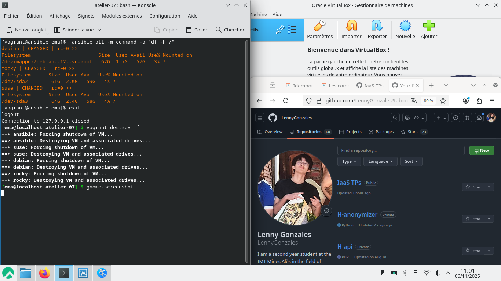

# Atelier 07

# À vous de jouer

Démarrage des VM :
```bash
$ vagrant up
```
Connexion au Control Host :
```bash
$ vagrant ssh ansible
```

Installez successivement les paquets tree, git et nmap sur toutes les cibles.
```bash
[vagrant@ansible ema]$ ansible all -m package -a "name=tree state=present"
...
suse | CHANGED => {
    "changed": true,
    "cmd": [
        "/usr/bin/zypper",
        "--quiet",
        "--non-interactive",
        "--xmlout",
        "install",
        "--type",
        "package",
        "--auto-agree-with-licenses",
        "--no-recommends",
        "--",
        "+tree"
    ],
    "name": [
        "tree"
    ],
    "rc": 0,
    "state": "present",
    "stderr": "",
    "stderr_lines": [],
    "stdout": "<?xml version='1.0'?>\n<stream>\n<install-summary download-size=\"56772\" space-usage-diff=\"116508\" space-usage-installed=\"116508\" space-usage-removed=\"0\" packages-to-change=\"1\" need-restart=\"0\" need-reboot=\"0\">\n<to-install>\n<solvable type=\"package\" name=\"tree\" edition=\"1.7.0-150000.3.2.1\" arch=\"x86_64\" repository=\"repo-sle-update\" summary=\"File listing as a tree\">\n<description>Tree is a recursive directory listing command that produces a depth\nindented listing of files, which is colorized ala dircolors if the\nLS_COLORS environment variable is set and output is to tty.</description></solvable>\n</to-install>\n</install-summary>\n<prompt id=\"0\">\n<text>Backend:  classic_rpmtrans\nContinue?</text>\n<option default=\"1\" value=\"y\" desc=\"Yes, accept the summary and proceed with installation/removal of packages.\"/>\n<option value=\"n\" desc=\"No, cancel the operation.\"/>\n<option value=\"v\" desc=\"Toggle display of package versions.\"/>\n<option value=\"a\" desc=\"Toggle display of package architectures.\"/>\n<option value=\"r\" desc=\"Toggle display of repositories from which the packages will be installed.\"/>\n<option value=\"m\" desc=\"Toggle display of package vendor names.\"/>\n<option value=\"d\" desc=\"Toggle between showing all details and as few details as possible.\"/>\n<option value=\"g\" desc=\"View the summary in pager.\"/>\n</prompt>\n<download url=\"http://fr2.rpmfind.net/linux/opensuse/update/leap/15.6/sle/x86_64/tree-1.7.0-150000.3.2.1.x86_64.rpm\" percent=\"-1\" rate=\"-1\"/>\n<download url=\"http://fr2.rpmfind.net/linux/opensuse/update/leap/15.6/sle/x86_64/tree-1.7.0-150000.3.2.1.x86_64.rpm\" percent=\"0\" rate=\"0\"/>\n<download url=\"http://fr2.rpmfind.net/linux/opensuse/update/leap/15.6/sle/x86_64/tree-1.7.0-150000.3.2.1.x86_64.rpm\" percent=\"4\" rate=\"2636\"/>\n<download url=\"http://fr2.rpmfind.net/linux/opensuse/update/leap/15.6/sle/x86_64/tree-1.7.0-150000.3.2.1.x86_64.rpm\" rate=\"2636\" done=\"1\"/>\n</stream>\n",
    "stdout_lines": [
        "<?xml version='1.0'?>",
        "<stream>",
        "<install-summary download-size=\"56772\" space-usage-diff=\"116508\" space-usage-installed=\"116508\" space-usage-removed=\"0\" packages-to-change=\"1\" need-restart=\"0\" need-reboot=\"0\">",
        "<to-install>",
        "<solvable type=\"package\" name=\"tree\" edition=\"1.7.0-150000.3.2.1\" arch=\"x86_64\" repository=\"repo-sle-update\" summary=\"File listing as a tree\">",
        "<description>Tree is a recursive directory listing command that produces a depth",
        "indented listing of files, which is colorized ala dircolors if the",
        "LS_COLORS environment variable is set and output is to tty.</description></solvable>",
        "</to-install>",
        "</install-summary>",
        "<prompt id=\"0\">",
        "<text>Backend:  classic_rpmtrans",
        "Continue?</text>",
        "<option default=\"1\" value=\"y\" desc=\"Yes, accept the summary and proceed with installation/removal of packages.\"/>",
        "<option value=\"n\" desc=\"No, cancel the operation.\"/>",
        "<option value=\"v\" desc=\"Toggle display of package versions.\"/>",
        "<option value=\"a\" desc=\"Toggle display of package architectures.\"/>",
        "<option value=\"r\" desc=\"Toggle display of repositories from which the packages will be installed.\"/>",
        "<option value=\"m\" desc=\"Toggle display of package vendor names.\"/>",
        "<option value=\"d\" desc=\"Toggle between showing all details and as few details as possible.\"/>",
        "<option value=\"g\" desc=\"View the summary in pager.\"/>",
        "</prompt>",
        "<download url=\"http://fr2.rpmfind.net/linux/opensuse/update/leap/15.6/sle/x86_64/tree-1.7.0-150000.3.2.1.x86_64.rpm\" percent=\"-1\" rate=\"-1\"/>",
        "<download url=\"http://fr2.rpmfind.net/linux/opensuse/update/leap/15.6/sle/x86_64/tree-1.7.0-150000.3.2.1.x86_64.rpm\" percent=\"0\" rate=\"0\"/>",
        "<download url=\"http://fr2.rpmfind.net/linux/opensuse/update/leap/15.6/sle/x86_64/tree-1.7.0-150000.3.2.1.x86_64.rpm\" percent=\"4\" rate=\"2636\"/>",
        "<download url=\"http://fr2.rpmfind.net/linux/opensuse/update/leap/15.6/sle/x86_64/tree-1.7.0-150000.3.2.1.x86_64.rpm\" rate=\"2636\" done=\"1\"/>",
        "</stream>"
    ],
    "update_cache": false
}
...
[vagrant@ansible ema]$ ansible all -m package -a "name=tree state=present"
debian | SUCCESS => {
    "cache_update_time": 1761245363,
    "cache_updated": false,
    "changed": false
}
suse | SUCCESS => {
    "changed": false,
    "name": [
        "tree"
    ],
    "rc": 0,
    "state": "present",
    "update_cache": false
}
rocky | SUCCESS => {
    "changed": false,
    "msg": "Nothing to do",
    "rc": 0,
    "results": []
}
```
```bash
[vagrant@ansible ema]$ ansible all -m package -a "name=git state=present"
rocky | CHANGED => {
    "changed": true,
    "msg": "",
    "rc": 0,
    "results": [
        "Installed: perl-Error-1:0.17029-7.el9.noarch",
        "Installed: perl-TermReadKey-2.38-11.el9.x86_64",
        "Installed: perl-lib-0.65-481.1.el9_6.x86_64",
        "Installed: git-core-2.47.3-1.el9_6.x86_64",
        "Installed: perl-File-Find-1.37-481.1.el9_6.noarch",
        "Installed: perl-Git-2.47.3-1.el9_6.noarch",
        "Installed: git-core-doc-2.47.3-1.el9_6.noarch",
        "Installed: git-2.47.3-1.el9_6.x86_64",
        "Installed: perl-DynaLoader-1.47-481.1.el9_6.x86_64"
    ]
}
...

[vagrant@ansible ema]$ ansible all -m package -a "name=git state=present"
debian | SUCCESS => {
    "cache_update_time": 1761245363,
    "cache_updated": false,
    "changed": false
}
suse | SUCCESS => {
    "changed": false,
    "name": [
        "git"
    ],
    "rc": 0,
    "state": "present",
    "update_cache": false
}
rocky | SUCCESS => {
    "changed": false,
    "msg": "Nothing to do",
    "rc": 0,
    "results": []
}
```

```bash
[vagrant@ansible ema]$ ansible all -m package -a "name=nmap state=present"
rocky | CHANGED => {
    "changed": true,
    "msg": "",
    "rc": 0,
    "results": [
        "Installed: nmap-3:7.92-3.el9.x86_64"
    ]
}
...

[vagrant@ansible ema]$ ansible all -m package -a "name=nmap state=present"
debian | SUCCESS => {
    "cache_update_time": 1761245363,
    "cache_updated": false,
    "changed": false
}
suse | SUCCESS => {
    "changed": false,
    "name": [
        "nmap"
    ],
    "rc": 0,
    "state": "present",
    "update_cache": false
}
rocky | SUCCESS => {
    "changed": false,
    "msg": "Nothing to do",
    "rc": 0,
    "results": []
}
```

Désinstallez successivement ces trois paquets en utilisant le paramètre supplémentaire state=absent.
```bash
[vagrant@ansible ema]$ ansible all -m package -a "name=tree state=absent"
suse | CHANGED => {
    "changed": true,
    "cmd": [
        "/usr/bin/zypper",
        "--quiet",
        "--non-interactive",
        "--xmlout",
        "remove",
        "--type",
        "package",
        "tree"
    ],
    "name": [
        "tree"
    ],
    "rc": 0,
    "state": "absent",
    "stderr": "",
    "stderr_lines": [],
    "stdout": "<?xml version='1.0'?>\n<stream>\n<install-summary download-size=\"0\" space-usage-diff=\"-116508\" space-usage-installed=\"0\" space-usage-removed=\"116508\" ...
    </prompt>\n</stream>\n",
    "stdout_lines": [
        "<?xml version='1.0'?>",
        "<stream>",
        "<install-summary download-size=\"0\" space-usage-diff=\"-116508\" space-usage-installed=\"0\" space-usage-removed=\"116508\" packages-to-change=\"1\" need-restart=\"0\" need-reboot=\"0\">",
        "<to-remove>",
        "<solvable type=\"package\" name=\"tree\" edition=\"1.7.0-150000.3.2.1\" arch=\"x86_64\" repository=\"@System\" summary=\"File listing as a tree\">",
        "<description>Tree is a recursive directory listing command that produces a depth",
        "indented listing of files, which is colorized ala dircolors if the",
        "LS_COLORS environment variable is set and output is to tty.</description></solvable>",
        "</to-remove>",
        "</install-summary>",
        "<prompt id=\"0\">",
        "<text>Backend:  classic_rpmtrans",
        "Continue?</text>",
        "<option default=\"1\" value=\"y\" desc=\"Yes, accept the summary and proceed with installation/removal of packages.\"/>",
        "<option value=\"n\" desc=\"No, cancel the operation.\"/>",
        "<option value=\"v\" desc=\"Toggle display of package versions.\"/>",
        "<option value=\"a\" desc=\"Toggle display of package architectures.\"/>",
        "<option value=\"r\" desc=\"Toggle display of repositories from which the packages will be installed.\"/>",
        "<option value=\"m\" desc=\"Toggle display of package vendor names.\"/>",
        "<option value=\"d\" desc=\"Toggle between showing all details and as few details as possible.\"/>",
        "<option value=\"g\" desc=\"View the summary in pager.\"/>",
        "</prompt>",
        "</stream>"
    ],
    "update_cache": false
}
rocky | CHANGED => {
    "changed": true,
    "msg": "",
    "rc": 0,
    "results": [
        "Removed: tree-1.8.0-10.el9.x86_64"
    ]
}
debian | CHANGED => {
    "changed": true,
    "stderr": "",
    "stderr_lines": [],
    "stdout": "Reading package lists...\nBuilding dependency tree...\nReading state information...\nThe following packages will be REMOVED:\n  tree\n0 upgraded, 0 newly installed, 1 to remove and 0 not upgraded.\nAfter this operation, 116 kB disk space will be freed.\n(Reading database ... \r(Reading database ... 5%\r(Reading database ... 10%\r(Reading database ... 15%\r(Reading database ... 20%\r(Reading database ... 25%\r(Reading database ... 30%\r(Reading database ... 35%\r(Reading database ... 40%\r(Reading database ... 45%\r(Reading database ... 50%\r(Reading database ... 55%\r(Reading database ... 60%\r(Reading database ... 65%\r(Reading database ... 70%\r(Reading database ... 75%\r(Reading database ... 80%\r(Reading database ... 85%\r(Reading database ... 90%\r(Reading database ... 95%\r(Reading database ... 100%\r(Reading database ... 36191 files and directories currently installed.)\r\nRemoving tree (2.1.0-1) ...\r\nProcessing triggers for man-db (2.11.2-2) ...\r\n",
    "stdout_lines": [
        "Reading package lists...",
        "Building dependency tree...",
        "Reading state information...",
        "The following packages will be REMOVED:",
        "  tree",
        "0 upgraded, 0 newly installed, 1 to remove and 0 not upgraded.",
        "After this operation, 116 kB disk space will be freed.",
        "(Reading database ... ",
        "(Reading database ... 5%",
        "(Reading database ... 10%",
        "(Reading database ... 15%",
        "(Reading database ... 20%",
        "(Reading database ... 25%",
        "(Reading database ... 30%",
        "(Reading database ... 35%",
        "(Reading database ... 40%",
        "(Reading database ... 45%",
        "(Reading database ... 50%",
        "(Reading database ... 55%",
        "(Reading database ... 60%",
        "(Reading database ... 65%",
        "(Reading database ... 70%",
        "(Reading database ... 75%",
        "(Reading database ... 80%",
        "(Reading database ... 85%",
        "(Reading database ... 90%",
        "(Reading database ... 95%",
        "(Reading database ... 100%",
        "(Reading database ... 36191 files and directories currently installed.)",
        "Removing tree (2.1.0-1) ...",
        "Processing triggers for man-db (2.11.2-2) ..."
    ]
}


[vagrant@ansible ema]$ ansible all -m package -a "name=tree state=absent"
debian | SUCCESS => {
    "changed": false
}
suse | SUCCESS => {
    "changed": false,
    "name": [
        "tree"
    ],
    "rc": 0,
    "state": "absent",
    "update_cache": false
}
rocky | SUCCESS => {
    "changed": false,
    "msg": "Nothing to do",
    "rc": 0,
    "results": []
}
```

```bash
[vagrant@ansible ema]$ ansible all -m package -a "name=git state=absent"
suse | CHANGED => {
    "changed": true,
    "cmd": [
        "/usr/bin/zypper",
        "--quiet",
        "--non-interactive",
        "--xmlout",
        "remove",
        "--type",
        "package",
        "git"
    ],
    "name": [
        "git"
    ],
    "rc": 0,
    "state": "absent",
    "stderr": "",
    "stderr_lines": [],
    "stdout": "<?xml version='1.0'?>\n<stream>\n<install-summary download-size=\"0\" space-usage-diff=\"-3662\" space-usage-installed=\"0\" space-usage-removed=\"3662\" packages-to-change=\"1\" need-restart=\"0\" need-reboot=\"0\">\n<to-remove>\n<solvable type=\"package\" name=\"git\" edition=\"2.51.0-150600.3.12.1\" arch=\"x86_64\" repository=\"@System\" summary=\"Fast, scalable, distributed revision control system\">\n<description>Git is a fast, scalable, distributed revision control system with an\nunusually rich command set that provides both high-level operations and\nfull access to internals.\n\nThis package itself only provides the README of git but with the\npackages it requires, it brings you a complete Git environment\nincluding GTK and email interfaces and tools for importing source code\nrepositories from other revision control systems such as subversion,\nCVS, and GNU arch.</description></solvable>\n</to-remove>\n</install-summary>\n<prompt id=\"0\">\n<text>Backend:  classic_rpmtrans\nContinue?</text>\n<option default=\"1\" value=\"y\" desc=\"Yes, accept the summary and proceed with installation/removal of packages.\"/>\n<option value=\"n\" desc=\"No, cancel the operation.\"/>\n<option value=\"v\" desc=\"Toggle display of package versions.\"/>\n<option value=\"a\" desc=\"Toggle display of package architectures.\"/>\n<option value=\"r\" desc=\"Toggle display of repositories from which the packages will be installed.\"/>\n<option value=\"m\" desc=\"Toggle display of package vendor names.\"/>\n<option value=\"d\" desc=\"Toggle between showing all details and as few details as possible.\"/>\n<option value=\"g\" desc=\"View the summary in pager.\"/>\n</prompt>\n</stream>\n",
    "stdout_lines": [
        "<?xml version='1.0'?>",
        "<stream>",
        "<install-summary download-size=\"0\" space-usage-diff=\"-3662\" space-usage-installed=\"0\" space-usage-removed=\"3662\" packages-to-change=\"1\" need-restart=\"0\" need-reboot=\"0\">",
        "<to-remove>",
        "<solvable type=\"package\" name=\"git\" edition=\"2.51.0-150600.3.12.1\" arch=\"x86_64\" repository=\"@System\" summary=\"Fast, scalable, distributed revision control system\">",
        "<description>Git is a fast, scalable, distributed revision control system with an",
        "unusually rich command set that provides both high-level operations and",
        "full access to internals.",
        "",
        "This package itself only provides the README of git but with the",
        "packages it requires, it brings you a complete Git environment",
        "including GTK and email interfaces and tools for importing source code",
        "repositories from other revision control systems such as subversion,",
        "CVS, and GNU arch.</description></solvable>",
        "</to-remove>",
        "</install-summary>",
        "<prompt id=\"0\">",
        "<text>Backend:  classic_rpmtrans",
        "Continue?</text>",
        "<option default=\"1\" value=\"y\" desc=\"Yes, accept the summary and proceed with installation/removal of packages.\"/>",
        "<option value=\"n\" desc=\"No, cancel the operation.\"/>",
        "<option value=\"v\" desc=\"Toggle display of package versions.\"/>",
        "<option value=\"a\" desc=\"Toggle display of package architectures.\"/>",
        "<option value=\"r\" desc=\"Toggle display of repositories from which the packages will be installed.\"/>",
        "<option value=\"m\" desc=\"Toggle display of package vendor names.\"/>",
        "<option value=\"d\" desc=\"Toggle between showing all details and as few details as possible.\"/>",
        "<option value=\"g\" desc=\"View the summary in pager.\"/>",
        "</prompt>",
        "</stream>"
    ],
    "update_cache": false
}
debian | CHANGED => {
    "changed": true,
    "stderr": "",
    "stderr_lines": [],
    "stdout": "Reading package lists...\nBuilding dependency tree...\nReading state information...\nThe following packages were automatically installed and are no longer required:\n  git-man liberror-perl patch\nUse 'sudo apt autoremove' to remove them.\nThe following packages will be REMOVED:\n  git\n0 upgraded, 0 newly installed, 1 to remove and 0 not upgraded.\nAfter this operation, 46.0 MB disk space will be freed.\n(Reading database ... \r(Reading database ... 5%\r(Reading database ... 10%\r(Reading database ... 15%\r(Reading database ... 20%\r(Reading database ... 25%\r(Reading database ... 30%\r(Reading database ... 35%\r(Reading database ... 40%\r(Reading database ... 45%\r(Reading database ... 50%\r(Reading database ... 55%\r(Reading database ... 60%\r(Reading database ... 65%\r(Reading database ... 70%\r(Reading database ... 75%\r(Reading database ... 80%\r(Reading database ... 85%\r(Reading database ... 90%\r(Reading database ... 95%\r(Reading database ... 100%\r(Reading database ... 36183 files and directories currently installed.)\r\nRemoving git (1:2.39.5-0+deb12u2) ...\r\n",
    "stdout_lines": [
        "Reading package lists...",
        "Building dependency tree...",
        "Reading state information...",
        "The following packages were automatically installed and are no longer required:",
        "  git-man liberror-perl patch",
        "Use 'sudo apt autoremove' to remove them.",
        "The following packages will be REMOVED:",
        "  git",
        "0 upgraded, 0 newly installed, 1 to remove and 0 not upgraded.",
        "After this operation, 46.0 MB disk space will be freed.",
        "(Reading database ... ",
        "(Reading database ... 5%",
        "(Reading database ... 10%",
        "(Reading database ... 15%",
        "(Reading database ... 20%",
        "(Reading database ... 25%",
        "(Reading database ... 30%",
        "(Reading database ... 35%",
        "(Reading database ... 40%",
        "(Reading database ... 45%",
        "(Reading database ... 50%",
        "(Reading database ... 55%",
        "(Reading database ... 60%",
        "(Reading database ... 65%",
        "(Reading database ... 70%",
        "(Reading database ... 75%",
        "(Reading database ... 80%",
        "(Reading database ... 85%",
        "(Reading database ... 90%",
        "(Reading database ... 95%",
        "(Reading database ... 100%",
        "(Reading database ... 36183 files and directories currently installed.)",
        "Removing git (1:2.39.5-0+deb12u2) ..."
    ]
}
rocky | CHANGED => {
    "changed": true,
    "msg": "",
    "rc": 0,
    "results": [
        "Removed: perl-Git-2.47.3-1.el9_6.noarch",
        "Removed: git-2.47.3-1.el9_6.x86_64"
    ]
}


[vagrant@ansible ema]$ ansible all -m package -a "name=git state=absent"
debian | SUCCESS => {
    "changed": false
}
suse | SUCCESS => {
    "changed": false,
    "name": [
        "git"
    ],
    "rc": 0,
    "state": "absent",
    "update_cache": false
}
rocky | SUCCESS => {
    "changed": false,
    "msg": "Nothing to do",
    "rc": 0,
    "results": []
}
```

```bash
[vagrant@ansible ema]$ ansible all -m package -a "name=nmap state=absent"
suse | CHANGED => {
    "changed": true,
    "cmd": [
        "/usr/bin/zypper",
        "--quiet",
        "--non-interactive",
        "--xmlout",
        "remove",
        "--type",
        "package",
        "nmap"
    ],
    "name": [
        "nmap"
    ],
    "rc": 0,
    "state": "absent",
    "stderr": "",
    "stderr_lines": [],
    "stdout": "<?xml version='1.0'?>\n<stream>\n<install-summary download-size=\"0\" space-usage-diff=\"-25883492\" space-usage-installed=\"0\" space-usage-removed=\"25883492\" packages-to-change=\"1\" need-restart=\"0\" need-reboot=\"0\">\n<to-remove>\n<solvable type=\"package\" name=\"nmap\" edition=\"7.94-lp156.1.2\" arch=\"x86_64\" repository=\"@System\" summary=\"Network exploration tool and security scanner\">\n<description>Nmap (&quot;Network Mapper&quot;) is a utility for network exploration or\nsecurity auditing. It may as well be used for tasks such as network\ninventory, managing service upgrade schedules, and monitoring host or\nservice uptime. Nmap uses raw IP packets to determine what hosts are\navailable on the network, what services (application name and\nversion) those hosts are offering, what operating systems (and OS\nversions) they are running, what type of packet filters/firewalls are\nin use, and dozens of other characteristics. It scans large networks,\nand works fine against single hosts.</description></solvable>\n</to-remove>\n</install-summary>\n<prompt id=\"0\">\n<text>Backend:  classic_rpmtrans\nContinue?</text>\n<option default=\"1\" value=\"y\" desc=\"Yes, accept the summary and proceed with installation/removal of packages.\"/>\n<option value=\"n\" desc=\"No, cancel the operation.\"/>\n<option value=\"v\" desc=\"Toggle display of package versions.\"/>\n<option value=\"a\" desc=\"Toggle display of package architectures.\"/>\n<option value=\"r\" desc=\"Toggle display of repositories from which the packages will be installed.\"/>\n<option value=\"m\" desc=\"Toggle display of package vendor names.\"/>\n<option value=\"d\" desc=\"Toggle between showing all details and as few details as possible.\"/>\n<option value=\"g\" desc=\"View the summary in pager.\"/>\n</prompt>\n</stream>\n",
    "stdout_lines": [
        "<?xml version='1.0'?>",
        "<stream>",
        "<install-summary download-size=\"0\" space-usage-diff=\"-25883492\" space-usage-installed=\"0\" space-usage-removed=\"25883492\" packages-to-change=\"1\" need-restart=\"0\" need-reboot=\"0\">",
        "<to-remove>",
        "<solvable type=\"package\" name=\"nmap\" edition=\"7.94-lp156.1.2\" arch=\"x86_64\" repository=\"@System\" summary=\"Network exploration tool and security scanner\">",
        "<description>Nmap (&quot;Network Mapper&quot;) is a utility for network exploration or",
        "security auditing. It may as well be used for tasks such as network",
        "inventory, managing service upgrade schedules, and monitoring host or",
        "service uptime. Nmap uses raw IP packets to determine what hosts are",
        "available on the network, what services (application name and",
        "version) those hosts are offering, what operating systems (and OS",
        "versions) they are running, what type of packet filters/firewalls are",
        "in use, and dozens of other characteristics. It scans large networks,",
        "and works fine against single hosts.</description></solvable>",
        "</to-remove>",
        "</install-summary>",
        "<prompt id=\"0\">",
        "<text>Backend:  classic_rpmtrans",
        "Continue?</text>",
        "<option default=\"1\" value=\"y\" desc=\"Yes, accept the summary and proceed with installation/removal of packages.\"/>",
        "<option value=\"n\" desc=\"No, cancel the operation.\"/>",
        "<option value=\"v\" desc=\"Toggle display of package versions.\"/>",
        "<option value=\"a\" desc=\"Toggle display of package architectures.\"/>",
        "<option value=\"r\" desc=\"Toggle display of repositories from which the packages will be installed.\"/>",
        "<option value=\"m\" desc=\"Toggle display of package vendor names.\"/>",
        "<option value=\"d\" desc=\"Toggle between showing all details and as few details as possible.\"/>",
        "<option value=\"g\" desc=\"View the summary in pager.\"/>",
        "</prompt>",
        "</stream>"
    ],
    "update_cache": false
}
rocky | CHANGED => {
    "changed": true,
    "msg": "",
    "rc": 0,
    "results": [
        "Removed: nmap-3:7.92-3.el9.x86_64"
    ]
}
debian | CHANGED => {
    "changed": true,
    "stderr": "",
    "stderr_lines": [],
    "stdout": "Reading package lists...\nBuilding dependency tree...\nReading state information...\nThe following packages were automatically installed and are no longer required:\n  git-man libblas3 liberror-perl liblinear4 liblua5.3-0 libpcap0.8 libpcre3\n  lua-lpeg nmap-common patch\nUse 'sudo apt autoremove' to remove them.\nThe following packages will be REMOVED:\n  nmap\n0 upgraded, 0 newly installed, 1 to remove and 0 not upgraded.\nAfter this operation, 4540 kB disk space will be freed.\n(Reading database ... \r(Reading database ... 5%\r(Reading database ... 10%\r(Reading database ... 15%\r(Reading database ... 20%\r(Reading database ... 25%\r(Reading database ... 30%\r(Reading database ... 35%\r(Reading database ... 40%\r(Reading database ... 45%\r(Reading database ... 50%\r(Reading database ... 55%\r(Reading database ... 60%\r(Reading database ... 65%\r(Reading database ... 70%\r(Reading database ... 75%\r(Reading database ... 80%\r(Reading database ... 85%\r(Reading database ... 90%\r(Reading database ... 95%\r(Reading database ... 100%\r(Reading database ... 35285 files and directories currently installed.)\r\nRemoving nmap (7.93+dfsg1-1) ...\r\nProcessing triggers for man-db (2.11.2-2) ...\r\n",
    "stdout_lines": [
        "Reading package lists...",
        "Building dependency tree...",
        "Reading state information...",
        "The following packages were automatically installed and are no longer required:",
        "  git-man libblas3 liberror-perl liblinear4 liblua5.3-0 libpcap0.8 libpcre3",
        "  lua-lpeg nmap-common patch",
        "Use 'sudo apt autoremove' to remove them.",
        "The following packages will be REMOVED:",
        "  nmap",
        "0 upgraded, 0 newly installed, 1 to remove and 0 not upgraded.",
        "After this operation, 4540 kB disk space will be freed.",
        "(Reading database ... ",
        "(Reading database ... 5%",
        "(Reading database ... 10%",
        "(Reading database ... 15%",
        "(Reading database ... 20%",
        "(Reading database ... 25%",
        "(Reading database ... 30%",
        "(Reading database ... 35%",
        "(Reading database ... 40%",
        "(Reading database ... 45%",
        "(Reading database ... 50%",
        "(Reading database ... 55%",
        "(Reading database ... 60%",
        "(Reading database ... 65%",
        "(Reading database ... 70%",
        "(Reading database ... 75%",
        "(Reading database ... 80%",
        "(Reading database ... 85%",
        "(Reading database ... 90%",
        "(Reading database ... 95%",
        "(Reading database ... 100%",
        "(Reading database ... 35285 files and directories currently installed.)",
        "Removing nmap (7.93+dfsg1-1) ...",
        "Processing triggers for man-db (2.11.2-2) ..."
    ]
}


[vagrant@ansible ema]$ ansible all -m package -a "name=nmap state=absent"
debian | SUCCESS => {
    "changed": false
}
suse | SUCCESS => {
    "changed": false,
    "name": [
        "nmap"
    ],
    "rc": 0,
    "state": "absent",
    "update_cache": false
}
rocky | SUCCESS => {
    "changed": false,
    "msg": "Nothing to do",
    "rc": 0,
    "results": []
}
```

Copiez le fichier /etc/fstab du Control Host vers tous les Target Hosts sous forme d'un fichier /tmp/test3.txt.
```bash
[vagrant@ansible ema]$ ansible all -m copy -a "src=/etc/fstab dest=/tmp/test3.txt"
debian | CHANGED => {
    "changed": true,
    "checksum": "0fe1d6fcaf1695fb3ef9d8a42d45d04e5e0c11c2",
    "dest": "/tmp/test3.txt",
    "gid": 0,
    "group": "root",
    "md5sum": "31623c38118cbe8247061a6bd3f239a4",
    "mode": "0644",
    "owner": "root",
    "size": 679,
    "src": "/home/vagrant/.ansible/tmp/ansible-tmp-1762423126.4629757-6782-37476990037188/source",
    "state": "file",
    "uid": 0
}
rocky | CHANGED => {
    "changed": true,
    "checksum": "0fe1d6fcaf1695fb3ef9d8a42d45d04e5e0c11c2",
    "dest": "/tmp/test3.txt",
    "gid": 0,
    "group": "root",
    "md5sum": "31623c38118cbe8247061a6bd3f239a4",
    "mode": "0644",
    "owner": "root",
    "secontext": "unconfined_u:object_r:user_home_t:s0",
    "size": 679,
    "src": "/home/vagrant/.ansible/tmp/ansible-tmp-1762423126.4690025-6781-87942280944982/source",
    "state": "file",
    "uid": 0
}
suse | CHANGED => {
    "changed": true,
    "checksum": "0fe1d6fcaf1695fb3ef9d8a42d45d04e5e0c11c2",
    "dest": "/tmp/test3.txt",
    "gid": 0,
    "group": "root",
    "md5sum": "31623c38118cbe8247061a6bd3f239a4",
    "mode": "0644",
    "owner": "root",
    "size": 679,
    "src": "/home/vagrant/.ansible/tmp/ansible-tmp-1762423126.4699442-6783-116582230530625/source",
    "state": "file",
    "uid": 0
}
[vagrant@ansible ema]$ ansible all -m copy -a "src=/etc/fstab dest=/tmp/test3.txt"
debian | SUCCESS => {
    "changed": false,
    "checksum": "0fe1d6fcaf1695fb3ef9d8a42d45d04e5e0c11c2",
    "dest": "/tmp/test3.txt",
    "gid": 0,
    "group": "root",
    "mode": "0644",
    "owner": "root",
    "path": "/tmp/test3.txt",
    "size": 679,
    "state": "file",
    "uid": 0
}
rocky | SUCCESS => {
    "changed": false,
    "checksum": "0fe1d6fcaf1695fb3ef9d8a42d45d04e5e0c11c2",
    "dest": "/tmp/test3.txt",
    "gid": 0,
    "group": "root",
    "mode": "0644",
    "owner": "root",
    "path": "/tmp/test3.txt",
    "secontext": "unconfined_u:object_r:user_home_t:s0",
    "size": 679,
    "state": "file",
    "uid": 0
}
suse | SUCCESS => {
    "changed": false,
    "checksum": "0fe1d6fcaf1695fb3ef9d8a42d45d04e5e0c11c2",
    "dest": "/tmp/test3.txt",
    "gid": 0,
    "group": "root",
    "mode": "0644",
    "owner": "root",
    "path": "/tmp/test3.txt",
    "size": 679,
    "state": "file",
    "uid": 0
}
```

Supprimez le fichier /tmp/test3.txt sur les Target Hosts en utilisant le module file avec le paramètre state=absent.
```bash
[vagrant@ansible ema]$ ansible all -m file -a "path=/tmp/test3.txt state=absent"debian | CHANGED => {
    "changed": true,
    "path": "/tmp/test3.txt",
    "state": "absent"
}
rocky | CHANGED => {
    "changed": true,
    "path": "/tmp/test3.txt",
    "state": "absent"
}
suse | CHANGED => {
    "changed": true,
    "path": "/tmp/test3.txt",
    "state": "absent"
}
[vagrant@ansible ema]$ ansible all -m file -a "path=/tmp/test3.txt state=absent"
debian | SUCCESS => {
    "changed": false,
    "path": "/tmp/test3.txt",
    "state": "absent"
}
rocky | SUCCESS => {
    "changed": false,
    "path": "/tmp/test3.txt",
    "state": "absent"
}
suse | SUCCESS => {
    "changed": false,
    "path": "/tmp/test3.txt",
    "state": "absent"
}
```

Enfin, affichez l'espace utilisé par la partition principale sur tous les Target Hosts. Que remarquez-vous ?
```bash
[vagrant@ansible ema]$  ansible all -m command -a "df -h /"
debian | CHANGED | rc=0 >>
Filesystem                       Size  Used Avail Use% Mounted on
/dev/mapper/debian--12--vg-root   62G  1.7G   57G   3% /
rocky | CHANGED | rc=0 >>
Filesystem      Size  Used Avail Use% Mounted on
/dev/sda2        61G  2.0G   59G   4% /
suse | CHANGED | rc=0 >>
Filesystem      Size  Used Avail Use% Mounted on
/dev/sda3        64G  2.4G   58G   4% /
```

Résultat :

