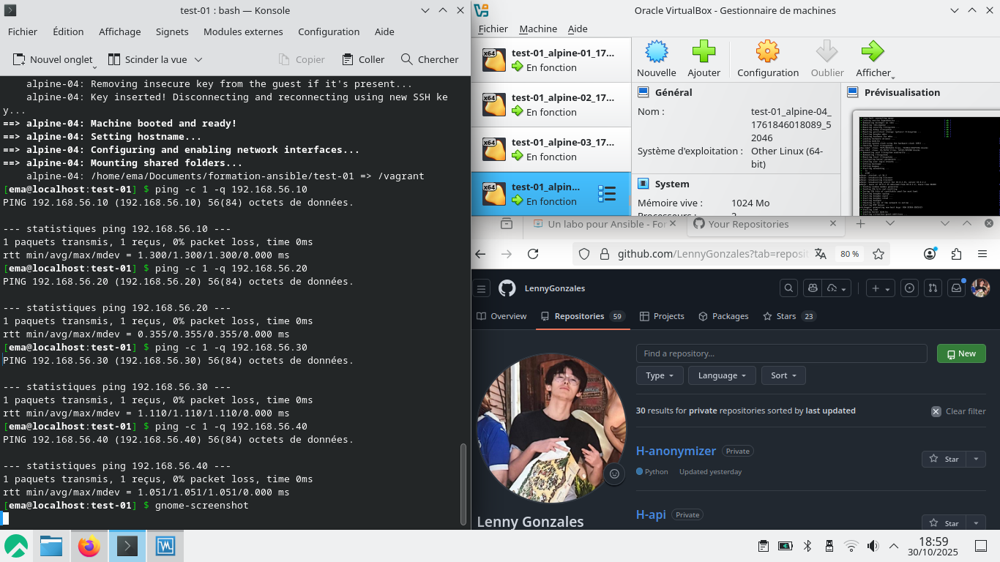

# Un labo pour ansible

# test 01

Récupérez les ateliers pratiques de la formation depuis mon dépôt GitLab :

```bash
$ git clone https://gitlab.com/kikinovak/formation-ansible
```

Pour tester le bon fonctionnement de Vagrant et de VirtualBox, on va lancer un premier cluster de quatre machines virtuelles Alpine Linux :

```bash
$ cd formation-ansible/test-01/
$ vagrant up
Bringing machine 'alpine-01' up with 'virtualbox' provider...
Bringing machine 'alpine-02' up with 'virtualbox' provider...
Bringing machine 'alpine-03' up with 'virtualbox' provider...
Bringing machine 'alpine-04' up with 'virtualbox' provider...
```

Vérifiez si vous pouvez envoyer un ping à chacun de ces hôtes :

```bash
$ ping -c 1 -q 192.168.56.10
...
1 packets transmitted, 1 received, 0% packet loss, time 0ms
$ ping -c 1 -q 192.168.56.20
...
1 packets transmitted, 1 received, 0% packet loss, time 0ms
$ ping -c 1 -q 192.168.56.30
...
1 packets transmitted, 1 received, 0% packet loss, time 0ms
$ ping -c 1 -q 192.168.56.40
...
1 packets transmitted, 1 received, 0% packet loss, time 0ms
```

Résultat :



## test 02

$ vagrant box add bento/rockylinux-9
$ vagrant box add bento/debian-12
$ vagrant box add bento/opensuse-leap-15
$ vagrant box add bento/ubuntu-22.04

Choisir le bon hyperviseur

Chacune de ces box est fournie pour toute une panoplie d'hyperviseurs : VirtualBox, HyperV, libvirt, QEMU, VMWare, etc. Veillez à bien sélectionner la version pour virtualbox.

Placez-vous dans le répertoire du deuxième test :

$ cd ~/formation-ansible/test-02

Lancez le cluster de VMs de ce deuxième test :

$ vagrant up

Là aussi, patientez quelques minutes et appréciez le résultat :

